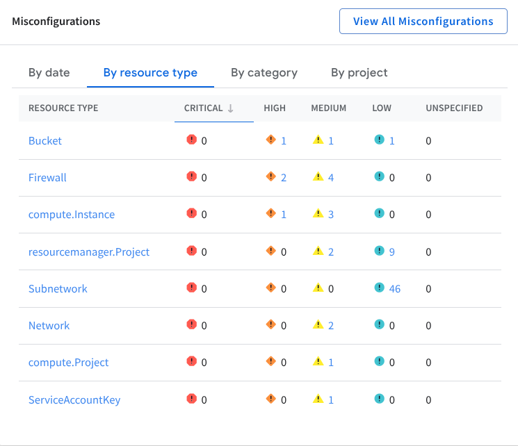

# GCP Capstone project

Steps to complete task

Here’s are the steps: 

Step 1: I will examine the vulnerabilities and findings in Google Cloud Security Command Center. 

Step 2:  I will shut the old VM down, and create a new VM from a snapshot. **Then**, you’ll evoke public access to the storage bucket and switch to uniform bucket-level access control.

Step 3: you’ll limit the firewall ports access and fix the firewall rules. **Finally**, you’ll run a report to verify the remediation of the vulnerabilities.

# Introduction:

Tasks:
1. examine the vulnerabilities and findings in Security Command Center SCC

- Review the risk overview
- Security > Risk overview
- See the misconfigurations by resource type to view all the  assets

# 

## Compliance check:

we need to check for compliance now

- Security Command center > Compliance
- look for the **Google Cloud compliance standards**
- click **PCI DSS 3.2.1**

Look for the findings column to sort(show all on top) and find

PCI DSS Review: the Payment card industry data security standard is a set of requirements that organizations have to follow to protect sensitive card holder data.

Retail companies that process a certain amount of CC transactisons have to abide by this

(Also have a tab in PCI DSS)

Looking for the rules that are non compliant or what caused the issue? (Data Breach)

### Vulnerabilities explained:

**Firewall rule logging should be enabled so you can audit network access**:
SEVERITY; Medium Severity
Finding shows that firewall rule must be enabled and it “firewall rules was not enabled”

No record of firewall rules being applied for traffic coming in and out of network

Difficult to track and investigate since we do not know what malicious was allowed in

Vulnerability:

Firewall rules should not be allowed connections from all IP address as on TCP or UDP port 3389 RDP

 SEVERITY: High severity finding!

What’s going on?

Firewall is being configured to allowed Remote Desktop Protocol traffic from all instances in the network

ANYONE in the internet can connect to the RDP port that is  a HUGE Secruty risk

Big red flag

Vulnerability:

Firewall rules should not be allowed to connections from all IPs to TCP or SCTP port 22 (SSH)

SEVERITY: HIGH

What's going on?

Firewall rules have been allowed SSH traffic from all instances of internet to machine, allowing remote access to a computer

Attacker can take control gain access to a machine through SSH and install malicious programs like malware or disrupt the system

Vulnerability:

VMs should not be assigned public IP addresses

SEVERITY : HIGH

What's going on?

an IP address is publically exposed to the internet and it can be accessible through unauthorized access

Attacker can scan for vulnerabilities and launch the attack 

Vulnerability:

Cloud storage bucket should not be annoymosly or publicly accessible

SEVERITY: HIGH

What's going on?

The ACL also an access control list can be accessed by anyone in the internet can read files stored in the bucket

Prioritized for remediation

Vulnerability:

**Instances should not be configured to use the default service account with full access to all Cloud APIs**

- Service account has Full access to cloud APIs
- this means service account can do access Google cloud environment
- perform any action within the GCP env, view sens data or modify configs

Vulnerability:

**VPC Flow logs should be Enabled for every subnet VPC Network**

- flow logs must be enabled.

values insight in the network to see what going on idenfy any patterns

Vulnerability:

**Basic roles (Owner, Writer, Reader) are too permissive and should not be used**:
Granting primitive roles in the cloud environemt

outbound traffic is not too restrictive

| **Findings category** | **Rule** |
| --- | --- |
| Firewall rule logging disabled | Firewall rule logging should be enabled so you can audit network access |
| Open RDP port | Firewall rules should not allow connections from all IP addresses on TCP or UDP port 3389 |
| Open SSH port | Firewall rules should not allow connections from all IP addresses on TCP or SCTP port 22 |
| Public IP address | VMs should not be assigned public IP addresses |
| Public bucket ACL | Cloud Storage buckets should not be anonymously or publicly accessible |
| Full API access | Instances should not be configured to use the default service account with full access to all Cloud APIs |
| Flow logs disabled | VPC Flow logs should be Enabled for every subnet VPC Network |
| Primitive roles used | Basic roles (Owner, Writer, Reader) are too permissive and should not be used |
| Egress deny rule not set | An egress deny rule should be set |

FINDINGS INDICATE POOR SECURITY CONTROLS IN PLACE!!

sorting the findings by identified vulns

SCC

SECURITY > FINDINGS

Check for Google cloud storage bucket

You should be able to see these findings:

- **Public bucket ACL**: This finding is listed in the PCI DSS report, and indicates that anyone with access to the internet can read the data stored in the bucket.
- **Bucket policy only disabled**: This indicates that there is no explicit bucket policy in place to control who can access the data in the bucket.
- **Bucket logging disabled**: This indicates that there is no logging enabled for the bucket, so it will be difficult to track who is accessing the data.

Data could be exposed to unauthorized access

What does this mean?

Poor configuration

- exposes the data to unauthorized access such as Public IP

But look before we continue

Bucket logging disabled*** 

You want to always have visbility of what is going on so making sure it is ENABLED is imperative 

### Remediation steps:

removing the public access control list, disabling public bucket access, and enabling the uniform bucket level access policy.

Uncheck Google cloud storage

**Filter for : Google compute instance**

VM listed cc-app-01

Active findings:

- **Malware bad domain**: This finding indicates that a domain known to be associated with malware was accessed from the google.compute.instance named cc-app-01. Although this finding is considered to be of low severity, it indicates that malicious activity has occurred on the virtual machine instance and that it has been compromised.
- **Compute secure boot disabled**: This medium severity finding indicates that secure boot is disabled for the virtual machine. This is a security risk as it allows the virtual machine to boot with unauthorized code, which could be used to compromise the system.
- **Default service account used**: This medium severity finding indicates that the virtual machine is using the default service account. This is a security risk as the default service account has a high level of access and could be compromised if an attacker gains access to the project.
- **Public IP address**: This high severity finding is listed in the PCI DSS report and indicates that the virtual machine has a public IP address. This is a security risk as it allows anyone on the internet to connect to the virtual machine directly.
- **Full API access**: This medium severity finding is listed in the PCI DSS report, and indicates that the virtual machine has been granted full access to all Google Cloud APIs.

VM was left in a way SUPER vulnerable to an attack

Left it easyily pwnable

Remediation #2:

you'll shut the original VM (cc-app-01) down, and create a VM (cc-app-02) using a clean snapshot of the disk. The new VM will have the following settings in place:

Configurations:

- No compute service account
- Firewall rule tag for a new rule for controlled SSH access
- Secure boot enabled
- Public IP address set to None

Time range: last 30 days

quick filters view: check **Google compute firewall**

Firewall findings:

- **Open SSH port**: This high severity finding indicates that the firewall is configured to allow Secure Shell (SSH) traffic to all instances in the network from the whole internet.
- **Open RDP port**: This high severity finding indicates that the firewall is configured to allow Remote Desktop Protocol (RDP) traffic to all instances in the network from the whole internet.
- **Firewall rule logging disabled**: This medium severity finding indicates that firewall rule logging is disabled. This means that there is no record of which firewall rules are being applied and what traffic is being allowed or denied.

Will also be listed in PCI DSS report

**ISSUES:**

lack of restricted access to these ports 22 and 3389

no records of any firewall rules

Remediate findings:

removing the existing firewall overly broad rules, and replacing them with a firewall rule that allows SSH access only from the addresses that are used by Google Cloud's IAP SSH service.

### **VM SHUTDOWN**

1. shut the old VM down as it is vulnerable and create a new VM

**Things to consider:**

ensure cc-app-02 is  turned off

then edit the VM by clicking the toolbar

make sure secure boot is enabled

- it was disabled

check vm instances and resume the new vm

Next task: Delete old vm

Fix cloud storage buckets permissions

1. In the **Navigation menu** (), select **Cloud Storage > Buckets**. The Buckets page opens.
    
    [navigation_menu](https://cdn.qwiklabs.com/tkgw1TDgj4Q%2BYKQUW4jUFd0O5OEKlUMBRYbhlCrF0WY%3D)
    
2. Click the **`qwiklabs-gcp-02-135b0a7bbba4`_bucket** storage bucket link. The Bucket details page opens.

go in the bottom and remove allUsers

**Task 4. Limit firewall ports access**

set the RDP and SSH ports for only authorized individuals

we need to change the firewall rules to allow what is necessary

Delete the bad configurations!!

 **default-allow-icmp**, **default-allow-rdp**, and **default-allow-ssh** 

**Delete delete!!**

Deleting these rules will restrict access to these protocols and ports

**One more thing:**

We see that logging is disabled

we need to enable the  firewall rules **limit-ports** (the rule you created in a previous task) and **default-allow-internal**.

We created custom firewall rules and enabled logging

we took care of 3 things

- open SSH port 22
- open RDP port 3389
- firewall rule logging disabled

Verify everything works properly

and then boom all finished

[Report](https://app.notion.com/p/Report-317b06ca3781809cb708e67cc9d83563?pvs=21)

[Challenge](https://app.notion.com/p/Challenge-318b06ca3781808599cbd0c3f4090d8b?pvs=21)

Professional summary example:

Entry-level cloud cybersecurity analyst seeking a full-time role. Recently completed the
Google Cloud Cybersecurity Certificate—a multi-month cloud cybersecurity program that
covers skills necessary to plan, configure, document, and monitor cloud security solutions